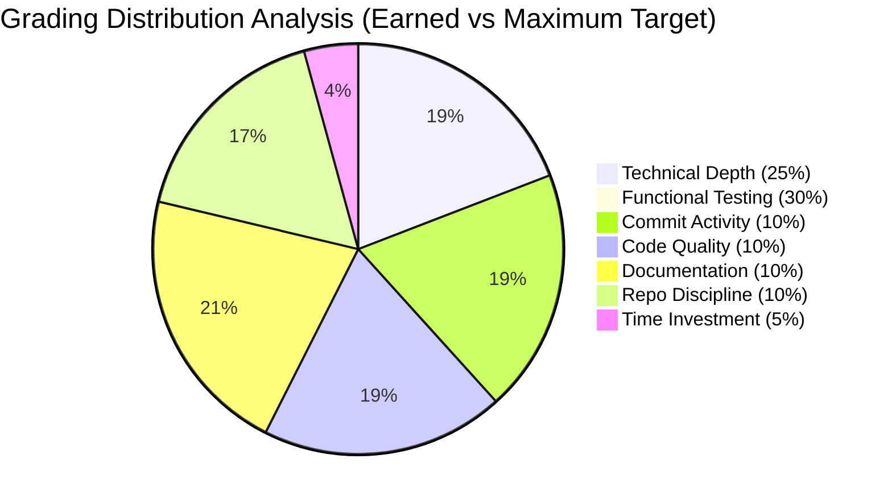

# 🛡️ ISU-Sec Auto-Grading Checkup Report

> **Auto-Generated by ISU Intelligence**  
> _Continuous Engineering & Open-Source Health Audit_

---

## 📑 Table of Contents

- [Executive Summary](#-executive-summary)
- [Grading Analytics](#-grading-analytics-radar)
- [Deep Static Analysis (Architecture & Security)](#-deep-static-analysis)
- [Repository Discipline (DevOps / SecOps)](#-repository-discipline)
- [Bonus & Deductions](#-bonus--deductions)
- [Pedagogical Guidance](#-pedagogical-guidance)

---

## 📊 Executive Summary

  
  
  

| Attribute           | Value                                 |
| :------------------ | :------------------------------------ |
| **Student**         | `Safa Hacıbayramoğlu` (`2420191014`) |
| **Course**          | `penetration-testing`                       |
| **Analyzed Commit** | `f3bb86a`                |
| **Timestamp**       | `4/7/2026, 2:55:00 AM`                  |

---

## 📈 Grading Analytics Radar

The grading logic is built upon consistency, architecture mastery, and documentation robustness. _Standing still causes silent decay._

| Metric Area            |      Awarded       | Weight Max | Grading Logic Analogy                                                   |
| :--------------------- | :----------------: | :--------: | :---------------------------------------------------------------------- |
| **Technical Depth**    | `35`  |     25     | _(Röntgen Analizi)_ Deep structural / architectural execution.          |
| **Functional Tests**   |  `Pending/TBD`  |     30     | _(Ameliyat)_ Instructor's live dynamic execution & exploit payload.     |
| **Code Quality**       |  `85`  |     10     | Spaghetti functions, modularity, comment ratios, TODO fatigue.          |
| **Commit Consistency** | `90` |     10     | Avoid single-commit dumps. Surgery shouldn't be a single cut.           |
| **Documentation**      |  `95`  |     10     | Readme, architecture diagrams, installation instructions.               |
| **Repo Discipline**    |  `80`  |     10     | Proper directory structure, `.gitignore`, CI/CD, dependency management. |
| **Time Investment**    |  `40`  |     5      | Dedicated, spaced-out working sessions (concrete needs time to dry).    |

---

## 🩻 Deep Static Analysis

This section analyzes the actual architectural capabilities and identifies both impressive implementations and critical security anti-patterns.

### 🛡️ Secure Configurations & Strong Patterns

- **[INFO]** `Express.js monolithic IDOR lab with intentional Broken Access Control (CWE-639) for educational demonstration`
- **[INFO]** `Python PoC exploit (exploit.py) properly implements ID enumeration with requests library, error handling, and throttle delay`
- **[INFO]** `Comprehensive OWASP WSTG-aligned CHECKLIST.md covering Horizontal & Vertical Privilege Escalation, CRUD, and parameter manipulation`
- **[INFO]** `MITIGATION.md includes secure code patch with session-ownership validation (req.session.userId check)`
- **[INFO]** `THREAT_MODEL.md provides STRIDE-based risk assessment with correct Information Disclosure as Critical`
- **[INFO]** `SECURITY.md establishes responsible disclosure protocol — professional open-source practice`
- **[INFO]** `.env.example demonstrates environment variable hygiene; .gitignore properly excludes .env variants`
- **[INFO]** `Well-structured src/ directory separation (server.js backend + index.html frontend)`
- **[INFO]** `JSDoc annotations in server.js with @api, @apiDescription, CWE references, and inline TODO/FIXME`

### 🛑 Critical Warnings & Security Debt

- **[WARNING]** `server.js is a single monolithic file (59 lines). No middleware extraction for logging, rate-limiting, or auth layers.`
- **[WARNING]** `Hardcoded in-memory mock database with only 3 records. No real persistence or dynamic data generation.`
- **[WARNING]** `No session management middleware (express-session not used). MITIGATION code references req.session but backend has no session setup.`
- **[WARNING]** `exploit.py lacks argument parsing (argparse), output file export, or structured JSON reporting of exfiltrated data.`
- **[WARNING]** `No unit tests or integration tests present. package.json test script is placeholder ("echo Error: no test specified").`
- **[WARNING]** `index.html uses inline CSS and inline JavaScript — no module separation or CSP-compatible patterns.`
- **[WARNING]** `TODO/FIXME annotations in server.js remain unresolved: helmet.js, Winston logging, Express-Rate-Limit, directory traversal protection.`

---

## 🏗️ Repository Discipline

Healthy open-source engineering demands discipline, CI/CD, and properly formatted environments.

| Check                        |        Verdict        | Impact          |
| :--------------------------- | :-------------------: | :-------------- |
| `.gitignore` present?        |  `✅ Yes`  | +15 Repo Points |
| CI/CD Pipelines Actions?     |    `❌ No`     | +25 Repo Points |
| `Dockerfile` configured?     |   `❌ No`    | +20 Repo Points |
| Package/Build Manager files? | `✅ Yes` | +20 Repo Points |

---

## 🎁 Bonus & Deductions

| Event Type    | Condition                                      | Point Modification         |
| :------------ | :--------------------------------------------- | :------------------------- |
| **[BONUS]**   | Video Demonstration Provided (`❌ No`) | `+10 Points`               |
| **[BONUS]**   | Manual Instructor Up-score Applied             | `+0 Points` |
| **[PENALTY]** | `.env` or Hardcoded Secrets Tracked            | `-0 Points (Clean)`           |

---

## 🎓 Pedagogical Guidance

> _"Bu sistem statik bir kağıt sınavı değil, canlı bir yazılım ekosistemidir. Siz commit atmasanız bile sistem periyodik olarak açık kaynak sağlık taramasını tekrarlar. Kodunuz yerinde saysa da teknoloji ve beklentiler ilerler."_ — **K. Arasteh**

You can continuously improve your repository up until the final deadline. Pushing cleanly structured commits and refactoring your architecture will immediately trigger the AI engine to update your metrics dynamically.
